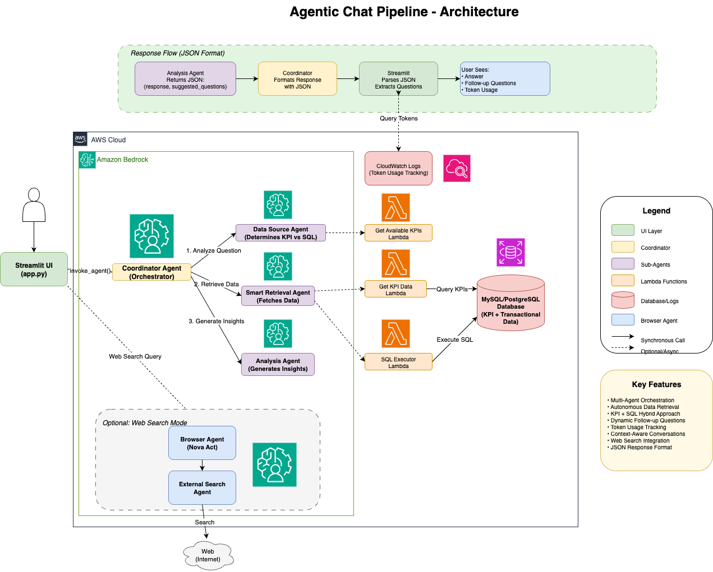

# QueenAI Agentic Chat Pipeline

An advanced multi-agent system for intelligent business data querying using AWS Bedrock Agents. This system provides a conversational interface for analyzing business KPIs and transactional data with AI-powered insights and dynamic follow-up questions.

## What is This Project?

The QueenAI Agentic Chat Pipeline is an **autonomous AI system** that enables natural language querying of business data. Instead of writing SQL queries or navigating complex dashboards, users can simply ask questions like "What were the total sales last month?" or "Show me the top 5 customers by revenue" and receive intelligent, contextual responses.

### How It Works

The system uses **four specialized AI agents** orchestrated by AWS Bedrock that work together autonomously:

1. **Coordinator Agent**: Receives your question and orchestrates the entire workflow
2. **Data Source Agent**: Analyzes your question to determine the best data source (KPIs vs. raw transactions)
3. **Smart Retrieval Agent**: Autonomously fetches the data by calling Lambda functions that query your database
4. **Analysis Agent**: Interprets the results, generates business insights, and suggests relevant follow-up questions

All of this happens automatically - the agents communicate with each other through AWS Bedrock's Agent Collaboration feature, with no custom orchestration code required.

### Key Innovation

Unlike traditional chatbots that require manual integration code, this system leverages **AWS Bedrock's native agent collaboration** to create a fully autonomous pipeline. The agents make their own decisions about:
- Which data sources to query
- Whether to use pre-calculated KPIs or run custom SQL queries
- How to interpret and present the results
- What follow-up questions would be most valuable

## Architecture



### Agent Workflow

```
User Query → Coordinator Agent
              ↓
         Data Source Agent (determines data source)
              ↓
         Smart Retrieval Agent (fetches data via KPIs or SQL)
              ↓
         Analysis Agent (generates insights + suggested questions)
              ↓
         Coordinator Agent (formats response)
              ↓
         User (receives answer + follow-up suggestions)
```

### Components

- **Coordinator Agent**: Orchestrates the entire workflow and manages context
- **Data Source Agent**: Analyzes questions to determine optimal data source
- **Smart Retrieval Agent**: Autonomously retrieves data from KPIs or database
- **Analysis Agent**: Interprets results and generates business insights
- **Browser Agent** (Optional): Performs web searches using AWS Nova Act

## Features

- 🤖 **Multi-Agent Architecture**: Four specialized agents working together autonomously via AWS Bedrock
- 💬 **Conversational UI**: Streamlit-based chat interface with real-time streaming responses
- 📊 **Intelligent Data Retrieval**: Automatically determines whether to use KPIs or SQL queries
- 🔍 **Web Search Integration**: Optional Browser Agent for external information retrieval using AWS Nova Act
- 💡 **Dynamic Follow-up Questions**: AI-generated contextual questions based on your conversation
- 📈 **Token Usage Tracking**: Real-time visibility into LLM token consumption via CloudWatch
- 🎯 **Context-Aware Memory**: Maintains conversation history for natural follow-up queries
- 🔒 **Security First**: SQL injection prevention, read-only queries, and org-level data isolation
- ⚡ **Performance Optimized**: Prompt caching, direct responses, and efficient agent routing
- 📊 **Workflow Visibility**: See exactly which agents were invoked and what data was retrieved

## Use Cases

### Business Analytics
- "What were our total sales last quarter?"
- "Show me the top 10 customers by revenue"
- "Compare Q1 2024 vs Q1 2023 performance"
- "Which products have the highest profit margins?"

### Operational Insights
- "How many orders did we process yesterday?"
- "What's the average transaction value for Store X?"
- "Show me sales trends for the last 6 months"
- "Which stores are underperforming this month?"

### Conversational Follow-ups
- Initial: "What were Circle K sales in January?"
- Follow-up: "What about February?" (remembers Circle K)
- Follow-up: "Show me the same for Kroger" (applies pattern to new entity)
- Follow-up: "How does that compare to last year?" (maintains full context)

### Web Research (Optional)
- "What's the latest news about Tesla?"
- "Find Amazon's current stock price"
- "Get information from this URL: https://example.com"

## Why This Project is Special

### 1. **True Autonomous Agents**
Unlike traditional chatbots that follow hardcoded logic, these agents make real decisions:
- The Smart Retrieval Agent decides whether to query KPIs, run SQL, or both
- The Analysis Agent determines what insights are relevant
- The Coordinator manages conversation flow dynamically

### 2. **No Custom Orchestration Code**
The entire agent workflow is configured in AWS Bedrock Console using native Agent Collaboration. There's no Python code managing agent handoffs - it's all declarative configuration.

### 3. **Conversation Memory**
The system maintains context across multiple turns:
- Remembers entities mentioned earlier ("Show me the same for Kroger")
- Resolves pronouns ("How does that compare to last month?")
- Applies query patterns to new contexts
- Isolates memory between different sessions

### 4. **Production-Ready**
Built with enterprise requirements in mind:
- Comprehensive error handling and retry logic
- SQL injection prevention and query validation
- Multi-tenant data isolation (org_id filtering)
- CloudWatch logging and monitoring
- Token usage tracking for cost management

### 5. **Extensible Architecture**
Easy to add new capabilities:
- Add new data sources by creating Lambda functions
- Integrate external APIs through action groups
- Add specialized agents for domain-specific tasks
- Extend with web search using Browser Agent

## Project Structure

```
.
├── agents/                    # Agent implementations and instructions
│   ├── coordinator_instructions.txt
│   ├── analysis/
│   ├── data_source/
│   └── smart_retrieval/
├── lambda/                    # AWS Lambda functions
│   ├── get_available_kpis/   # KPI metadata retrieval
│   ├── get_kpi_data/         # KPI data retrieval
│   └── sql_executor/         # SQL query execution
├── infrastructure/            # AWS CDK infrastructure code
│   └── cdk/
├── ui/                       # Streamlit user interface
│   └── app.py               # Main chat interface
├── Browser Agent/            # Web search integration (optional)
├── config/                   # Configuration utilities
├── tools/                    # Metadata loader tools
├── database/                 # Database setup scripts
├── requirements.txt          # Python dependencies
├── .env.example             # Environment template
└── architecture_diagram.png  # System architecture diagram
```

## Prerequisites

- Python 3.9+
- AWS Account with Bedrock access
- AWS CLI configured
- Node.js and AWS CDK (for infrastructure deployment)
- MySQL/PostgreSQL database (for transactional data)

## Quick Start

### 1. Clone and Setup

```bash
git clone <repository-url>
cd AWS_chat
python3 -m venv venv
source venv/bin/activate  # On Windows: venv\Scripts\activate
pip install -r requirements.txt
```

### 2. Configure Environment

```bash
cp .env.example .env
```

Edit `.env` and configure:
- `AWS_REGION`: Your AWS region (e.g., us-west-2)
- `BEDROCK_AGENT_ID`: Your Bedrock Coordinator Agent ID
- `BEDROCK_AGENT_ALIAS_ID`: Your Bedrock Agent Alias ID
- Database connection details (if using transactional data)

### 3. Deploy Infrastructure

See [DEPLOYMENT_GUIDE.md](DEPLOYMENT_GUIDE.md) for detailed deployment instructions.

```bash
cd infrastructure/cdk
cdk deploy
```

### 4. Launch UI

```bash
streamlit run ui/app.py
```

The UI will be available at `http://localhost:8501`

## Configuration

### Required Environment Variables

```bash
# AWS Configuration
AWS_REGION=us-west-2

# Bedrock Agent Configuration
BEDROCK_AGENT_ID=your_agent_id
BEDROCK_AGENT_ALIAS_ID=your_alias_id

# Database Configuration (optional)
DB_HOST=your_db_host
DB_PORT=3306
DB_NAME=your_db_name
DB_USER=your_db_user
DB_PASSWORD=your_db_password
```

### Optional Features

**Web Search (Browser Agent)**:
- Set `BROWSER_AGENT_ARN` in `.env`
- See `Browser Agent/README.md` for setup instructions

## Usage

### Example Queries

```
"What were the total sales last month?"
"Compare revenue between Q1 and Q2 in 2023"
"Show me the top 5 customers by revenue"
"What were the monthly trends for Customer A?"
```

### Features

1. **Dynamic Follow-up Questions**: After each response, the system suggests relevant follow-up questions
2. **Token Usage Tracking**: View token consumption for each query in the workflow expander
3. **Web Search Mode**: Toggle between internal data and web search
4. **Session Management**: Conversations maintain context across multiple queries

## Development

### Running Tests

#### Lambda Function Tests
Test individual Lambda functions:

```bash
# Test SQL executor
python lambda/sql_executor/test_lambda.py

# Test deployed Lambda
python lambda/sql_executor/test_lambda.py --deployed
```

### Deploying Agent Updates

```bash
# Deploy coordinator
cd agents
./deploy_coordinator.sh

# Deploy individual agents
cd agents/analysis
./deploy.sh
```

### Viewing Logs

CloudWatch logs are available at:
- Log Group: `BedrockLogging`
- Contains model invocations and token usage
- Query example:
  ```bash
  aws logs tail BedrockLogging --since 20m --region us-west-2 --format short
  ```

## Architecture Details

For detailed architecture information, see [BEDROCK_AGENT_ARCHITECTURE.md](BEDROCK_AGENT_ARCHITECTURE.md)

### Key Design Decisions

- **JSON Response Format**: Coordinator returns structured JSON for reliable parsing
- **Context Summarization**: Prevents token explosion in long conversations
- **Autonomous Retrieval**: Smart Retrieval Agent decides between KPIs and SQL
- **Token Tracking**: CloudWatch integration for cost visibility

## Troubleshooting

### Common Issues

**"Agent not found" error**:
- Verify `BEDROCK_AGENT_ID` and `BEDROCK_AGENT_ALIAS_ID` in `.env`
- Ensure agent alias points to the latest version

**Token usage shows 0**:
- CloudWatch logs may have a delay (wait 30-60 seconds)
- Verify CloudWatch logging is enabled for Bedrock

**Suggested questions not appearing**:
- Ensure coordinator agent is using the latest instructions
- Check that agent alias is updated after deployment

## Contributing

1. Create a feature branch
2. Make your changes
3. Test thoroughly
4. Submit a pull request

## License

Proprietary - QueenAI

## Support

For issues or questions, please contact the development team.
