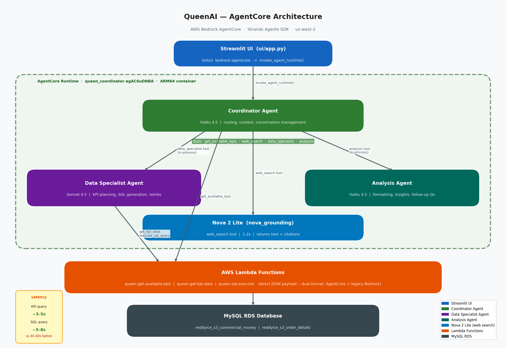

# QueenAI Agentic Chat Pipeline

A conversational AI system for natural language querying of business KPI and transactional data, built on **AWS Bedrock AgentCore** with the **Strands Agents SDK**.

## Architecture



One AgentCore runtime hosts three Strands agents running in-process:

```
User → Streamlit UI
  → invoke_agent_runtime → AgentCore Runtime (queen_coordinator)
      Coordinator Agent (Haiku 4.5) — routing, context, conversation
        → data_specialist tool → Data Specialist Agent (Sonnet 4.5)
            → get_kpi_data Lambda → MySQL RDS
            → execute_sql_query Lambda → MySQL RDS
        → analysis tool → Analysis Agent (Haiku 4.5)
        → web_search tool → Nova 2 Lite (nova_grounding)
        → get_available_kpis tool → Lambda
  ← JSON response: { response, suggested_questions }
```

No network hops between agents — all three run in the same container. This replaces the old 4-agent Bedrock Agents setup that took 40–60 seconds per query.

## Project Structure

```
.
├── agents/
│   ├── coordinator/        # Coordinator Agent (entry point)
│   │   ├── entrypoint.py   # AgentCore app — deployed to AWS
│   │   ├── agent.py        # Strands Agent definition
│   │   ├── prompts.py      # System prompt
│   │   └── web_search.py   # Nova 2 Lite web search
│   ├── specialist/         # Data Specialist Agent
│   │   ├── agent.py
│   │   └── prompts.py
│   ├── analysis/           # Analysis Agent
│   │   ├── agent.py
│   │   └── prompts.py
│   └── _legacy/            # Old Bedrock Agents code (reference only)
├── lambda/
│   ├── get_available_kpis/ # Returns KPI metadata for a customer
│   ├── get_kpi_data/       # Retrieves KPI data from MySQL
│   └── sql_executor/       # Executes SELECT queries against MySQL
├── infrastructure/
│   └── cdk/
│       └── bedrock_agent_stack.py  # CDK stack (Lambda + AgentCore IAM)
├── ui/
│   └── app.py              # Streamlit chat interface
├── Browser Agent/          # Separate browser automation agent (legacy)
├── entrypoint.py           # Root-level stub (AgentCore uses agents/coordinator/entrypoint.py)
├── .bedrock_agentcore.yaml # AgentCore CLI config
└── .env.example            # Environment variable template
```

## Quick Start

### Prerequisites
- Python 3.10+
- AWS account with Bedrock access (us-west-2)
- AWS CLI configured (`aws configure`)
- Virtual environment: `source venv/bin/activate`

### Run the UI

```bash
source venv/bin/activate
streamlit run ui/app.py
```

Requires `.env` with:
```
AGENTCORE_AGENT_ID=queen_coordinator-agAC6uDNBA
AWS_REGION=us-west-2
```

### Redeploy the Agent

```bash
source venv/bin/activate
agentcore launch --auto-update-on-conflict
```

### Run Tests

```bash
# Agent unit tests
python3 -m pytest agents/specialist/test_specialist.py agents/coordinator/test_coordinator.py -v

# Lambda tests (run per-directory due to name collision)
python3 -m pytest lambda/get_available_kpis/test_lambda.py -v
python3 -m pytest lambda/get_kpi_data/test_lambda.py -v
python3 -m pytest lambda/sql_executor/test_lambda.py -v
```

## Environment Variables

```bash
# Required
AGENTCORE_AGENT_ID=queen_coordinator-agAC6uDNBA
AWS_REGION=us-west-2

# Database (for Lambda functions)
DB_HOST=...
DB_PORT=3306
DB_NAME=...
DB_USER=...
DB_PASSWORD=...
```

## Deployed Resources

| Resource | ID / Name |
|---|---|
| AgentCore Runtime | `queen_coordinator-agAC6uDNBA` |
| Lambda: get_available_kpis | `queen-get-available-kpis-lambda` |
| Lambda: get_kpi_data | `queen-get-kpi-data-lambda` |
| Lambda: sql_executor | `queen-sql-executor-lambda` |
| CloudWatch Logs | `/aws/bedrock-agentcore/runtimes/queen_coordinator-agAC6uDNBA-DEFAULT` |

## Example Queries

- "What were Customer A's total sales in Q4 2024?"
- "Show me out-of-stock rates for all customers this month"
- "Compare January 2025 revenue to January 2024"
- "What's the latest news about Reddy Ice?"

## Legacy

The original 4-agent Bedrock Agents implementation (40–60s latency) is preserved in `agents/_legacy/` for reference. The CDK stack previously deployed those agents; the updated stack in `infrastructure/cdk/bedrock_agent_stack.py` provisions only the Lambda functions and AgentCore IAM role.
